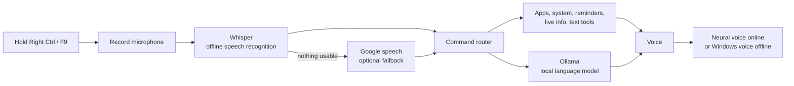

<div align="center">


# Anaya AI

Hold a key, speak, and Anaya controls your computer, answers questions, sets reminders and types for you.

[](https://github.com/nextginfosoft/Anaya-AI/actions/workflows/tests.yml)
[](LICENSE)


</div>

---

## Why Anaya

- **Your voice stays on your PC.** Speech is recognised offline with Whisper; chat runs on a local model through Ollama. Google speech is only a fallback, and you can switch it off.
- **Hold-to-talk, not always listening.** Anaya records only while you hold **Right Ctrl** (or **F9**). No wake word, no open microphone.
- **Works on a quiet laptop microphone.** Audio is boosted and filtered, and on a synthetic quiet-audio test offline Whisper got 10/10 commands right against Google's 8/10.
- **English and Hindi.** Recognises both, and core commands work in Hindi and Hinglish.
- **Does real things.** Volume, brightness, lock screen, reminders, dictation into any window, weather, news, translation, summaries, your own app shortcuts and more.
- **Starts with Windows**, speaks a short morning briefing, and recovers from crashes by itself.

> Anaya AI is developed by **Santosh Pandit** and is based on the original **Maya AI 1.2** by **Taha Shaikh** (MIT). See [Credits](#credits).

---

## Quick start (Windows)

**You need:** Windows 10/11, Python 3.12 or newer (developed on 3.14), a microphone, and [Ollama](https://ollama.com/download).

```powershell
git clone https://github.com/nextginfosoft/Anaya-AI.git
cd Anaya-AI
.\scripts\setup.ps1          # creates a venv, installs packages, pulls the local AI model
.\venv\Scripts\python.exe main.py
```

Then **hold Right Ctrl, say "open Chrome", and let go.**

The first start downloads the Whisper speech model (about 150 MB). Until it is ready, Anaya uses Google speech.

Want her to start with Windows? Run `.\scripts\install_startup.ps1` (undo with `.\scripts\uninstall_startup.ps1`).

<details>
<summary>Manual install, without the script</summary>

```powershell
python -m venv venv
.\venv\Scripts\activate
pip install -r requirements.txt
ollama pull llama3.2:3b
python main.py
```
</details>

---

## What she can do

| Area | Say, for example |
|---|---|
| **Open things** | "Open Chrome", "open Notepad", "open folder downloads", "open github" (from your own `apps.json`) |
| **Computer control** | "Volume up", "set volume to 40", "mute", "brightness down", "lock the screen", "screenshot" |
| **Information** | "What time is it", "battery level", "weather in Delhi", "tell me the news", "who is Sundar Pichai" |
| **Reminders** | "Remind me in ten minutes to call Raj", "set a timer for five minutes", "what are my reminders" |
| **Typing and reading** | "Start dictation" (types into the active window), "read the clipboard", "read this" |
| **Text tools** | "Translate this to Hindi", "summarise what I copied" |
| **Chat** | Any other question goes to the local model, with memory for follow-ups; "forget that" clears it |
| **Briefing** | "Give me my briefing": time, battery, weather, reminders, headlines. Also plays after sign-in. |
| **Languages** | "Switch to Hindi" / "switch to English"; core commands also work in Hindi |

Press **Esc** (or a talk key) at any time to cut her off while she speaks.

The full list with exact phrasing is in [docs/COMMANDS.md](docs/COMMANDS.md). A printable overview is in [docs/Anaya_AI_Features.pdf](docs/Anaya_AI_Features.pdf).

---

## How it works



More detail: [docs/ARCHITECTURE.md](docs/ARCHITECTURE.md).

---

## Privacy

| Part | What happens | Leaves your PC? |
|---|---|---|
| Hearing | Whisper runs locally | No. Google gets audio only if Whisper hears nothing usable (`ANAYA_STT_FALLBACK=0` forbids it) |
| Thinking | Ollama runs the model locally | No |
| Speaking | A Microsoft neural voice reads replies | The **spoken reply text** goes to Microsoft. `ANAYA_TTS=windows` keeps it fully offline |
| Private text | Clipboard, selection, summaries and translations always use the offline voice | No |
| Weather, news, Wikipedia | Looks things up on Open-Meteo, Google News and Wikipedia | The words of your request |
| Recordings | Not saved. `ANAYA_DEBUG_AUDIO=1` keeps the last 30 rejected clips for debugging | Local only |

See [SECURITY.md](SECURITY.md) for how to report a problem.

---

## Settings

Settings are environment variables beginning with `ANAYA_` (the old `MAYA_` names still work). The most useful:

| Setting | Default | What it does |
|---|---|---|
| `ANAYA_PTT_KEY` | `right ctrl,f9` | Talk keys (comma separated) |
| `ANAYA_MODE` | `ptt` | `wake` switches to saying "Anaya" instead of holding a key |
| `ANAYA_STT_FALLBACK` | `1` | `0` = never send audio to Google |
| `ANAYA_TTS` | `edge` | `windows` = offline voice only |
| `ANAYA_MODEL` | `llama3.2:3b` | Any Ollama model you have installed |
| `ANAYA_CITY` | from your IP | Default city for weather and the briefing |
| `ANAYA_BRIEFING` | `1` | `0` turns off the briefing after sign-in |

All settings, `apps.json` and the files Anaya creates are explained in [docs/CONFIGURATION.md](docs/CONFIGURATION.md).

---

## Troubleshooting

| Problem | Try |
|---|---|
| She mishears me or says "I did not catch that" | Raise the microphone level in **Settings > System > Sound > Input** to 100%, and speak close to the mic. A headset helps most. |
| Nothing happens when I hold the key | Another app may be using it, or an administrator-level window has focus. Try `ANAYA_PTT_KEY=f8`. |
| "The AI is not running" | Start Ollama, then check `ollama list` shows your model. |
| "The AI model ... is not installed" | Run `ollama pull llama3.2:3b`. |
| She answers twice | Only one copy should run. A second launch exits by itself; check Task Manager for stray `python` processes. |
| First start is slow | The Whisper model is downloading (about 150 MB). It only happens once. |
| Where are the logs? | `anaya.log` in the project folder when started at sign-in (it is rotated at 1 MB). |

---

## Project layout

```
Anaya-AI/
├── main.py                 # the assistant (single file, section by section)
├── apps.json               # your spoken app and website shortcuts
├── scripts/                # setup.ps1, install_startup.ps1, uninstall_startup.ps1
├── tests/                  # automated tests (no microphone or internet needed)
├── docs/                   # commands, configuration, architecture, PDF guide
├── requirements.txt        # runtime packages
├── requirements-dev.txt    # adds pytest
└── LICENSE
```

## Development

```powershell
pip install -r requirements-dev.txt
python -m pytest
```

See [CONTRIBUTING.md](CONTRIBUTING.md) and [CHANGELOG.md](CHANGELOG.md).

---

## Credits

**Anaya AI** is developed by **Santosh Pandit**.

It is based on **Maya AI 1.2** by **Taha Shaikh**, released under the MIT License. The history of that original work is preserved in this repository.

## License

[MIT](LICENSE). Copyright (c) 2026 Taha Shaikh (original Maya AI) and Santosh Pandit (Anaya AI changes and additions).
